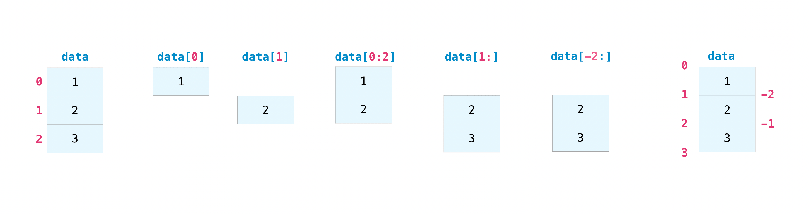

# Numpy基础

这里记录[Numpy](https://numpy.org/)(Numerical Python)的基础操作


## Quick start

参考[NumPy: the absolute basics for beginners](https://numpy.org/doc/stable/user/absolute_beginners.html)
摘录了文档并加入一些自己的笔记
### 安装
在conda下
```bash
conda install numpy
```
在pip下
```bash
pip install numpy
```
jupyter
```bash
!pip install numpy
```

### 导入
```python
import numpy as np
```

### Python list和 Numpy array区别
在python中，list中的数据可以是不同类型；在Numpy array中，必须是同质(homogeneous).如果数组不是同质的，那么对数组进行的数学操作将会非常低效。

>NumPy arrays are faster and more compact than Python lists. An array consumes less memory and is convenient to use. NumPy uses much less memory to store data and it provides a mechanism of specifying the data types. This allows the code to be optimized even further.

NumPy数组比Python列表更快，更紧凑。数组占用更少的内存并且使用起来更方便。NumPy使用更少的内存来存储数据，并提供了一种指定数据类型的机制。这使得代码可以进一步优化。

### 什么是array
>An array is a central data structure of the NumPy library. An array is a grid of values and it contains information about the raw data, how to locate an element, and how to interpret an element. It has a grid of elements that can be indexed in various ways. The elements are all of the same type, referred to as the array dtype.

数组是NumPy库的核心数据结构。数组是一个数值网格，它包含有关原始数据的信息，如何定位一个元素以及如何解释一个元素。它包含一系列可以以多种方式进行索引的元素。这些元素都是相同类型的，被称为数组的数据类型（dtype）。

>An array can be indexed by a tuple of nonnegative integers, by booleans, by another array, or by integers. The rank of the array is the number of dimensions. The shape of the array is a tuple of integers giving the size of the array along each dimension.

数组可以通过<mark>非负整数的元组、布尔值、另一个数组或整数进行索引</mark>。数组的秩（rank）是指数组的维度数量。数组的形状（shape）是一个由<mark>整数组成的元组</mark>，它给出了数组沿着每个维度的大小。


numpy定义数组的例子
```python
a = np.array([1,2,3,4,5])
b = np.array([[1,2,3,4],[5,6,7,8],[9,10,11,12]])

```

>You might occasionally hear an array referred to as a “ndarray,” which is shorthand for “N-dimensional array.” An N-dimensional array is simply an array with any number of dimensions. You might also hear 1-D, or one-dimensional array, 2-D, or two-dimensional array, and so on. The NumPy ndarray class is used to represent both matrices and vectors. A vector is an array with a single dimension (there’s no difference between row and column vectors), while a matrix refers to an array with two dimensions. For 3-D or higher dimensional arrays, the term tensor is also commonly used.


有时你可能会听到将数组称为“ndarray”，这是“N维数组”的简写。N维数组就是具有任意数量维度的数组。你可能也会听到1维数组（one-dimensional array）、2维数组（two-dimensional array）等。NumPy的ndarray类用于表示矩阵和向量。向量是一个只有一个维度的数组（行向量和列向量之间没有区别），而矩阵则指的是具有两个维度的数组。对于3维或更高维的数组，通常也会使用张量（tensor）这个术语。

#### array的属性(attributes)
>An array is usually a fixed-size container of items of the same type and size. The number of dimensions and items in an array is defined by its shape. The shape of an array is a tuple of non-negative integers that specify the sizes of each dimension.

一个数组通常是一个固定大小的容器，其中包含相同类型和大小的项目。数组的维数和项目数量由其形状定义。数组的形状是一个由非负整数组成的元组，指定了每个维度的大小。

在numpy中，维度也被称为轴(axes)

```python
[[0,0,0],
[1,1,1]]
```
上面这个例子中，第一个轴(axis)的length是2，第二轴的length是3.

note: shape是[2,3],第0轴是长度2，第1轴长度3

扩展阅读:

[The N-dimensional array](https://numpy.org/doc/stable/reference/arrays.ndarray.html#arrays-ndarray)

[Array objects](https://numpy.org/doc/stable/reference/arrays.html#arrays)

### 创建array
```python
import numpy as np

a = np.array([1,2,3])
```


其他的创建方式
```python
#全0
a = np.zeros(2)
#全1
a = np.ones(2)
#空,元素随机
a = np.empty(2)
```
使用empty的理由:
>The reason to use empty over zeros (or something similar) is speed - just make sure to fill every element afterwards

arange：
```python
np.arange(4)
np.arange(4,9,2) #(first number,last number,step size)
```

linespace:
```python
np.linspace(0, 10, num=5)
#array([ 0. ,  2.5,  5. ,  7.5, 10. ])
```
创建的array 默认元素类型是`np.float64`,如果需要自定义，可以如下:
```python
x = np.ones(2, dtype=np.int64)
```

### shape和size

- `ndarray.ndim` 数组的维度数(轴数)
- `ndarray.size` 数组的元素数
- `ndarray.shape`数组的形状

example:
```python
array_example = np.array([[[0, 1, 2, 3],
                           [4, 5, 6, 7]],

                          [[0, 1, 2, 3],
                           [4, 5, 6, 7]],

                          [[0 ,1 ,2, 3],
                           [4, 5, 6, 7]]])
```
数组的`ndim`为3，`size`为24，`shape`为 (3,2,4). 

### reshape
reshape用的方法为 `arr.reshape()`

example:
```python
a = np.arange(6)
#[0 1 2 3 4 5]
b = a.reshape(3,2)
#[[0 1]
# [2 3]
# [4 5]]
```

### add a new axis

用`np.newaxis`

example:
```python
a = np.array([1, 2, 3, 4, 5, 6])
a.shape
#(6,)
a2 = a[np.newaxis, :]
a2.shape
#(1,6)
```
数组可以转为行向量、列向量
>You can explicitly convert a 1D array with either a row vector or a column vector using np.newaxis. For example, you can convert a 1D array to a row vector by inserting an axis along the first dimension:
```python
row_vector = a[np.newaxis, :]
row_vector.shape
#(1, 6)
```


> for a column vector, you can insert an axis along the second dimension
```python
col_vector = a[:, np.newaxis]
col_vector.shape
#(6, 1)
```
从代码实践来看，numpy的行向量，列向量表示像matrix，GPT回答：
>在NumPy中，行向量和列向量实际上也可以被视为特殊的矩阵，因为它们都是二维数组。行向量是一个包含一行元素的二维数组，而列向量是一个包含一列元素的二维数组。因此，它们可以被视为特殊情况的矩阵，只是维度较小而已。在NumPy中，可以使用相同的方式来处理行向量、列向量和一般的矩阵，因为它们都是二维数组。

扩展阅读:
https://numpy.org/doc/stable/reference/generated/numpy.expand_dims.html#numpy.expand_dims

### 索引和切片
定义数据如`data = np.array([1, 2, 3])`



这里还有一些操作参照文档即可，暂不记录

### 从已有数据创建array

TODO:这里需要补充一些python的list操作笔记

从已有数组创建
```python
a = np.array([1,  2,  3,  4,  5,  6,  7,  8,  9, 10])
```

从已有数据中选取一个片段来创建
```python
arr1 = a[3:8]
```

还有`vstack`, `hstack`等操作，比较细节的知识点参照文档

